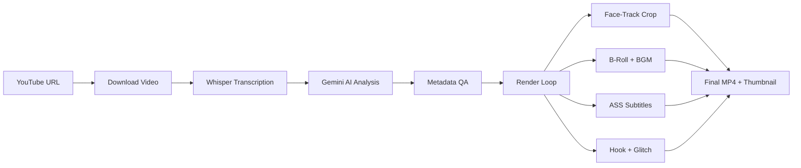

# 🎬 OpenSource Clipping

**Ultimate AI Auto-Clipper & Teaser Generator** — an open-source content factory that transforms long-form videos into cinematic short-form highlights with hook teasers, karaoke subtitles, and auto-thumbnails.

> 🇮🇩 [Baca dalam Bahasa Indonesia](README_ID.md)

---

## ✨ Features

| Feature | Description |
|---|---|
| **AI Transcriber** | Word-level transcription using **Faster-Whisper** (large-v3) |
| **AI Content Curator** | **Google Gemini** analyzes context, picks the most viral moments, and generates metadata |
| **Smart Auto-Framing** | Face-tracking via **[MediaPipe BlazeFace (Full-Range)](https://ai.google.dev/edge/mediapipe/solutions/vision/face_detector)** with Smooth Pan, Deadzone & anti-jitter algorithms |
| **Cinematic Teaser Hook** | 3-second hook with dark overlay, cinematic bars, and **TV Glitch** transition |
| **Karaoke Subtitles** | Word-by-word highlighted `.ASS` subtitles (Alex Hormozi / Veed style) |
| **Kinetic Typography** | AI-driven word emphasis with bounce/stagger animations & dual-font system |
| **B-Roll Integration** | Auto-fetches contextual stock footage from **Pexels** with crossfade & Ken Burns |
| **Auto-BGM & Ducking** | AI-matched background music from Pixabay with sidechain ducking |
| **Auto-Thumbnail** | Frame extraction with dark overlay and large title text |
| **Cross-Platform Metadata** | YouTube title/description/tags + TikTok caption — all in English |
| **Auto YouTube Uploader** | Automatically upload highlight clips to YouTube with scheduling support and full metadata (optional) |
| **Podcast Split-Screen** | Auto speaker diarization via **Pyannote** with top-bottom split-screen layout for 2-speaker podcasts (9:16) |

## 📋 Prerequisites

- **Python** 3.10+
- **FFmpeg** installed and available in PATH
- **CUDA GPU** recommended (for Whisper; CPU fallback available)
- **Google Gemini API Key** ([get one here](https://aistudio.google.com/apikey))
- **Pexels API Key** (optional, for B-roll — [get one here](https://www.pexels.com/api/))
- **HuggingFace Token** (optional, for split-screen — [get one here](https://huggingface.co/settings/tokens), requires accepting [Pyannote model agreement](https://huggingface.co/pyannote/speaker-diarization-3.1))

## ☁️ Running on Google Colab (Recommended)

If you don't have a local GPU, the easiest way to run this pipeline is via **Google Colab**.
Open a new Google Colab notebook, set the Runtime to **T4 GPU**, and create the following cells:

**Cell 1: Setup & Clone**
```python
!rm -rf ./* ./.*
!git clone https://github.com/your-username/opensource-clipping.git .
!pip install -r requirements.txt
```

**Cell 2: Setup API Keys**
```python
import os
from pathlib import Path
from google.colab import userdata

# Store your keys in Colab Secrets first!
GOOGLE_API_KEY = userdata.get("GOOGLE_API_KEY")

env_text = f"GOOGLE_API_KEY={GOOGLE_API_KEY}\n"
Path(".env").write_text(env_text, encoding="utf-8")
```

**Cell 3: Execute (Example including Kaggle fallback for float32)**
```python
URL_YOUTUBE = "https://www.youtube.com/watch?v=Dc4_aBFAYWE&pp=0gcJCdkKAYcqIYzv"
JUMLAH_CLIP = 10
RASIO = "9:16"
FONT_STYLE = "DEFAULT"
GEMINI_MODEL = "gemini-3-flash-preview"
# Use 'float32' for Kaggle CPU/T4 limitations, or 'float16' for standard Colab T4 GPUs
WHISPER_COMPUTE_TYPE = "float32"

!python main.py \
  --url "{URL_YOUTUBE}" \
  --clips {JUMLAH_CLIP} \
  --ratio "{RASIO}" \
  --font-style "{FONT_STYLE}" \
  --hook-duration 3 \
  --words-per-sub 5 \
  --gemini-model "{GEMINI_MODEL}" \
  --whisper-compute-type "{WHISPER_COMPUTE_TYPE}" \
  --no-bgm
```

*(Note: We have also included `notebooks/Lib_OpenSource_Clipping.ipynb` in the repo as a ready-to-use template).*

---

## 🚀 Local Quick Start

```bash
# 1. Clone the repo
git clone https://github.com/your-username/opensource-clipping.git
cd opensource-clipping

# 2. Install dependencies (pick one)
pip install -r requirements.txt          # pip / Colab
# uv sync                               # or use uv (reads pyproject.toml)

# 3. Set up API keys
cp .env.sample .env
# Edit .env and add your GOOGLE_API_KEY

# 4. Run with defaults
python main.py
# uv run main.py                        # if using uv

# 5. Examples of Execution

# Standard run (Default options with 5 clips)
python main.py --url "https://youtube.com/watch?v=VIDEO_ID" --clips 5 --ratio 16:9

# Advanced run (Using YOLOv8 GPU Face Tracking & Custom Fonts)
python main.py --url "https://youtube.com/watch?v=VIDEO_ID" \
  --clips 7 \
  --face-detector yolo \
  --yolo-size 8m \
  --font-style STORYTELLER

# Podcast Split-Screen (2 speakers, 9:16)
python main.py --url "https://youtube.com/watch?v=PODCAST_ID" \
  --clips 3 \
  --ratio "9:16" \
  --split-screen
```

## ⚙️ CLI Options

```
python main.py --help
```

| Argument | Default | Description |
|---|---|---|
| `--url`, `-u` | *(preset URL)* | YouTube video URL to process |
| `--clips`, `-n` | `7` | Number of highlight clips to generate |
| `--ratio`, `-r` | `9:16` | Output aspect ratio (`9:16` or `16:9`) |
| `--words-per-sub` | `5` | Max words per karaoke subtitle group |
| `--hook-duration` | `3` | Hook teaser duration (seconds) |
| `--font-style` | `HORMOZI` | Font preset (`DEFAULT`, `STORYTELLER`, `HORMOZI`, `CINEMATIC`) |
| `--no-broll` | — | Disable B-roll footage |
| `--no-hook` | — | Disable hook glitch teaser |
| `--no-bgm` | — | Disable background music |
| `--no-karaoke` | — | Use clean text instead of karaoke highlight |
| `--advanced-text` | `False` | Enable kinetic typography (word scaling & animation) |
| `--use-dlp-subs` | — | Use YouTube's built-in subtitles to speed up process (skips Whisper if found) |
| `--face-detector` | `mediapipe` | AI model for face tracking (`mediapipe` or `yolo`) |
| `--yolo-size` | `8m` | YOLO face track model (`8n`, `8s`, `8m`, `8n_v2`, `9c`) |
| `--whisper-model` | `large-v3` | Whisper model size ([see here](https://github.com/SYSTRAN/faster-whisper?tab=readme-ov-file#whisper) for options) |
| `--whisper-device` | `cuda` | Whisper device (`cuda`, `cpu`, `auto`) |
| `--whisper-compute-type` | `float16` | Compute type for Whisper (`float16`, `int8`, etc.) |
| `--gemini-model` | `gemini-3-flash-preview` | Gemini model name |
| `--gemini-fallback-model` | `gemini-2.5-flash` | Gemini fallback model name if main model fails |
| `--split-screen` | `False` | Enable split-screen mode for 2-speaker podcasts (9:16 only, requires `HF_TOKEN`) |
| `--diarization-speakers` | `2` | Number of speakers for diarization (used with `--split-screen`) |

## 📂 Project Structure

```
opensource-clipping/
├── main.py                  # CLI entry point
├── run_upload.py            # YouTube auto-uploader CLI
├── pyproject.toml           # Dependencies & metadata
├── .env.sample              # API key template
├── .gitignore
├── README.md                # English docs
├── README_ID.md             # Indonesian docs
├── clipping/
│   ├── __init__.py
│   ├── config.py            # Master configuration & argparse
│   ├── engine.py            # Download → Transcribe → Gemini AI
│   ├── diarization.py       # Pyannote speaker diarization (split-screen)
│   ├── metadata.py          # QA metadata normalization
│   ├── studio.py            # Video render engine (face-track, split-screen, subs, B-roll, BGM)
│   └── runner.py            # Pipeline orchestrator
└── youtube_uploader/
    ├── __init__.py
    └── uploader.py          # YouTube upload & scheduling logic
```

## 🔄 Pipeline Flow



## 📤 Output

For each clip, the pipeline creates an `outputs/` directory and generates:

| File | Description |
|---|---|
| `outputs/highlight_rank_N_ready.mp4` | Final rendered clip with subtitles, B-roll, BGM |
| `outputs/thumbnail_rank_N.jpg` | Auto-generated thumbnail with title text |
| `outputs/render_manifest.json` | Manifest with metadata for all clips |
| `outputs/metadata_preview.json` | Gemini-generated metadata (titles, tags, captions) |

## 🎵 Font Styles

| Style | Main Font | Emphasis Font | Best For |
|---|---|---|---|
| `HORMOZI` | Montserrat | Anton | Business / motivational |
| `STORYTELLER` | Inter | Lora | Narrative / storytelling |
| `CINEMATIC` | Roboto | Bebas Neue | Film / dramatic |
| `DEFAULT` | Montserrat Black | Montserrat Medium | General purpose |

## 📺 Auto-Upload to YouTube

The project now includes a standalone YouTube auto-uploader with scheduling support!

1. Place your configured `youtube_token.json` file inside the `.credentials/` directory.
2. After the rendering process finishes, the script will automatically read from the generated `outputs/` directory (e.g., `outputs/render_manifest.json` and the final videos). Simply run the uploader:
   ```bash
   # Basic run (uses default 8-hour interval and auto timezone)
   python run_upload.py

   # Or run with custom arguments (example):
   python run_upload.py --interval-hours 12 --tz-name "Asia/Jakarta"
   ```
3. To run a test with only the first video, use `python run_upload.py --test-mode`. Run `python run_upload.py --help` to see all scheduling and timezone options.

## 📄 License

Open source. Feel free to use, modify, and distribute.
